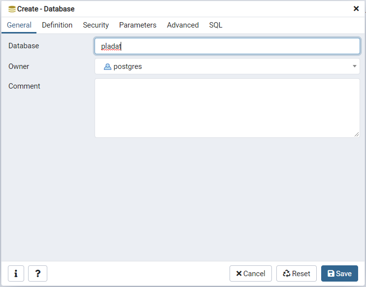

- [1. Project Proposal](#1-project-proposal)
  - [1.1 Project Abstract](#11-project-abstract)
  - [1.2 Project Scope](#12-project-scope)
  - [1.3 Project License](#13-project-license)
  - [1.4 Sponsor](#14-sponsor)
- [2. Project Structure](#2-project-structure)
  - [2.1 Project Team](#21-project-team)
- [2.2 Useful Links](#22-useful-links)
- [3. Project Stack](#3-project-stack)
  - [3.1 Technologies](#31-technologies)
- [4. Project setup](#4-project-setup)
  - [4.1 Frontend](#41-frontend)
  - [4.2 Backend](#42-backend)
  - [4.3 Database](#43-database)

---

## 1. Project Proposal

### 1.1 Project Abstract

This project will create a matching service to connect placement students with potential employers. Using a “dating” service metaphor, the site will allow employers to post details of placements available and students to apply for placements. 
The aim of the project is to create a database-driven mobile-friendly website to encourage employers and students to engage in year-long paid industrial placements as part of an honours degree programme. 

### 1.2 Project Scope

The project comprises three main elements: 

  - placement descriptions; 
  - student capabilities;
  - matching algorithm. 

Users (employers and students) will need to be able register with the site and store details of placements and capabilities. Some persistent storage will be required to retain placement details, student capabilities, and user credentials.

### 1.3 Project License

The project will be made available with an MIT license.

### 1.4 Sponsor

Julian M. Bass

Senior Lecturer (Associate Professor) of Software Engineering at the University of Salford, Manchester, UK

---

## 2. Project Structure
The project will follow a SCRUM-like agile method, which includes defining a SCRUM Master, a Product Owner and a Development Team. This definition of roles creates an initial distinction in tasks and duties for a successful delivery of the final software. 

### 2.1 Project Team

|         Name         |      Role     |                            University                                |  Email  |
|:--------------------:|:-------------:|:--------------------------------------------------------------------:|:-------:|  
| William Nordberg     | Product Owner | [Mälardalen University](https://www.mdh.se/en/malardalen-university) | [william.nordberg3@gmail.com](mailto:william.nordberg3@gmail.com)        |
| Bassam Zabad         | Developer     | [Mälardalen University](https://www.mdh.se/en/malardalen-university) | [bassam.zabad88@gmail.com](mailto:bassam.zabad88@gmail.com)           |
| Alice Casali         | Developer     | [Politecnico di Milano](https://www.polimi.it/)                      | [alice.casali@mail.polimi.it](mailto:alice.casali@mail.polimi.it)        |
| Fabrizio Siciliano   | SCRUM Master  | [Politecnico di Milano](https://www.polimi.it/)                      | [fabrizio.siciliano@mail.polimi.it](mailto:fabrizio.siciliano@mail.polimi.it)  |
| Aida Denisa Opîrlesc | Developer     | [Politecnico di Milano](https://www.polimi.it/)                      | [aidadenisa.opirlesc@mail.polimi.it](mailto:aidadenisa.opirlesc@mail.polimi.it) |
| Anna Bergamasco      | Developer     | [Politecnico di Milano](https://www.polimi.it/)                      | [anna.bergamasco@mail.polimi.it](mailto:anna.bergamasco@mail.polimi.it)     |
| Anđela Zorić         | Developer     | [Mälardalen University](https://www.mdh.se/en/malardalen-university) | [andjela.zoric@gmail.com](mailto:andjela.zoric@gmail.com)            |

## 2.2 Useful Links

- [Google Drive](https://drive.google.com/drive/folders/1uC0bpIpx8PbYAirWj4T_9s9fEPUDn9Cf?usp=sharing)
- [Discord Server](https://discord.gg/Rn4Ggnb)
- [Jira Board](https://pladat.atlassian.net/secure/RapidBoard.jspa?projectKey=PLAD&rapidView=1)
- [Figma Board](https://www.figma.com/files/project/16799299/PlaDat)

---

## 3. Project Stack

### 3.1 Technologies


> #### 3.1.1 Front-end
> [](https://flutter.dev/)

> #### 3.1.2 Back-end
> [](https://nodejs.org/en/)

> #### 3.1.3 Database
>  [](https://www.postgresql.org/)

> #### 3.1.4 Communication technology
>  [](https://restfulapi.net/)

> #### 3.1.5 Deployment and storage
>  [](https://www.heroku.com/)

--- 
## 4. Project setup
 
### 4.1 Frontend
 
Please make sure to satisfy the following requirements before the frontend setup: 
- Flutter is installed on your machine. If not, you can follow this guide [here](https://flutter.dev/docs/get-started/install);
- Your Flutter environment has to have web development enabled. You can do this by entering the following commands in your command line prompt of choice or follow this [step by step guide](https://flutter.dev/docs/get-started/web):
```
flutter channel beta
flutter upgrade
flutter config --enable-web
```
 
Once the requirements have been completed, please go ahead and follow the next steps:
- Open a command line prompt on your local machine and type `cd <path_to_project>/frontend`;
- Run the following command: `flutter build web`;
- Whenever you need to debug your application, you can use the following command: `flutter run -d chrome` (make sure to have Chrome installed).
 
### 4.2 Backend
 
Please make sure to satisfy the following requirements before the backend setup:
- Install Node.js and npm from this link [here](https://nodejs.org/en/);
 
Once the requirements have been completed, please go ahead and follow the next steps:
- Open a command line prompt on your local machine and type the following commands:
```
cd <path_to_project>/backend
npm start
```
- You should be able to check your backend by opening your browser of choice and navigating to the URL that is prompted after the `npm start`

### 4.3 Database
Please make sure to satisfy the following requirements before the backend setup:

- Install PostgreSQL from this link [here](https://www.postgresql.org/download/);
  - **NB: Take careful note of the password that you're going to give to postgres in the wizard while installing!**
- Install PGAdming4 from this link [here](https://www.pgadmin.org/download/);
- Make sure to have installed the `knex` package globally by running the following command in your prompt of choice:
```
npm i -g knex
```

Once the requirements have been completed, please go ahead and follow the next steps:
1. Create a new database:
   1. Fire up PGAdming 4, login and create a new database by right click on the database in your server, `Create > Database`;

   1. Insert the database name (of your choice) and keep that in mind;

   3. Save the new database;
2. Configure Node.js
   1. Open the backend folder of this project and create a new file called `.env`;
   2. Fill in the document with the following information by replacing the information with your own, keep the values in the double quotes:
```
DEV_DB_HOST="localhost"
DEV_DB_NAME="name_of_your_database"
DEV_DB_USR="your_username"
DEV_DB_PORT="port_of_your_database"
DEV_DB_PWD="your_password"
NODE_ENV="development" #do not change this

```
   3. Check that everything is correct by doing the first migration:
```
cd <project_folder>/backend
knex migrate:latest 
```   